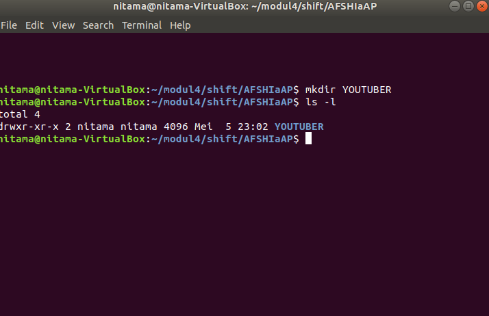
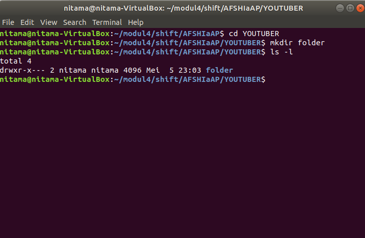
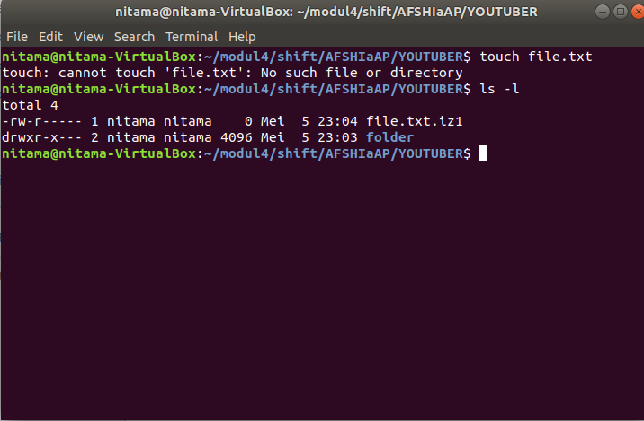
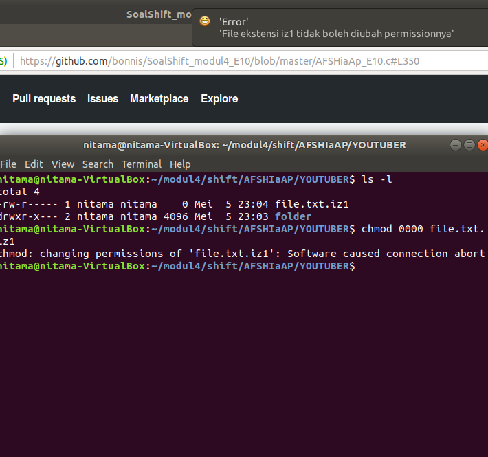

# Soal Shift Modul 4

## Nomor 1

Pertama-tama dibuat fungsi pembantu *search()* yang berfungsi untuk memudahkan proses cipher dengan mencari tahu urutan keberapa sebuah karakter di dalam char list. Lalu dibuat fungsi *encrypt()* dan *decrypt()* untuk melakukan enkripsinya itu sendiri, kedua fungsi ini dibantu oleh fungsi *search()* yang tadi dibuat.

Untuk mengaplikasikan enkripsi ini, setiap ada variabel yang mengadung path/direktori sebuah file, maka string dari direktori/path tersebut akan di enkripsi atau di dekripsi sesuai dengan kebutuhan.

## Nomor 3

Permasalahan ini bisa diselesaikan dengan menggunakan fungsi *stat()*, lalu di fungsi *readdir* akan dilakukan pengecekan ke setiap file. Jika group id, user id dan permission dari sebuah file memenuhi syarat yang ada, maka program akan melakukan *fopen()* dengan mode append. Informasi yang relevan akan di tarik dari program dan dimasukkan ke dalam file yang ada. Dengan *fopen()*, jika file belum ada maka file akan otomatis terbuat dan data baru akan otomatis terappend ke file tersebut.

## Nomor 4

  1. Membuat folder YOUTUBER   
    
    
  2. Membuat folder di dalam folder YOUTUBER 
    Permissionnya akan menjadi 750  
    
  
  3. Membuat file di dalam folder YOUTUBER  
    Permissionnya akan menjadi 640 dan nama file akan bertambah extension .iz1  
    
    
  4. File permission tidak dapat diubah. Jika diubah akan memunculkan kalimat 4.“File ekstensi iz1 tidak boleh diubah permissionnya.”  
    
